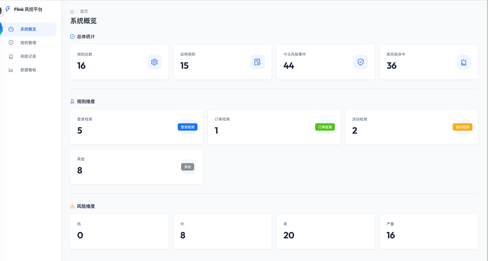
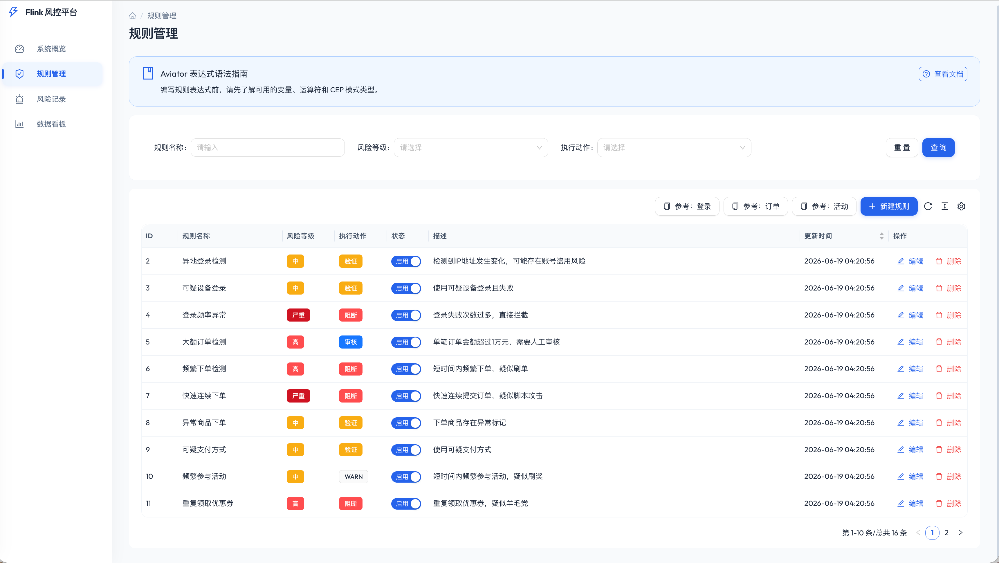
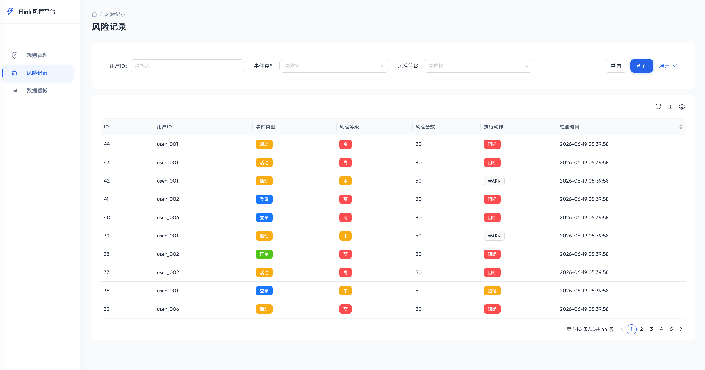
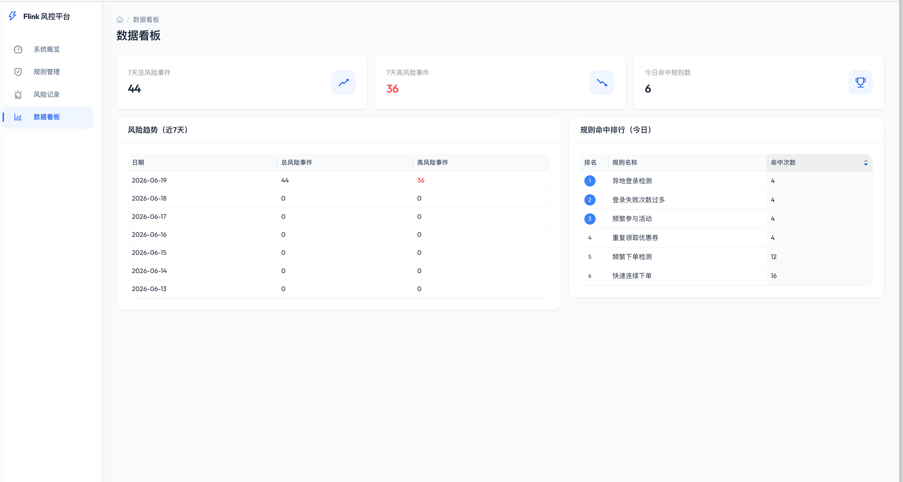
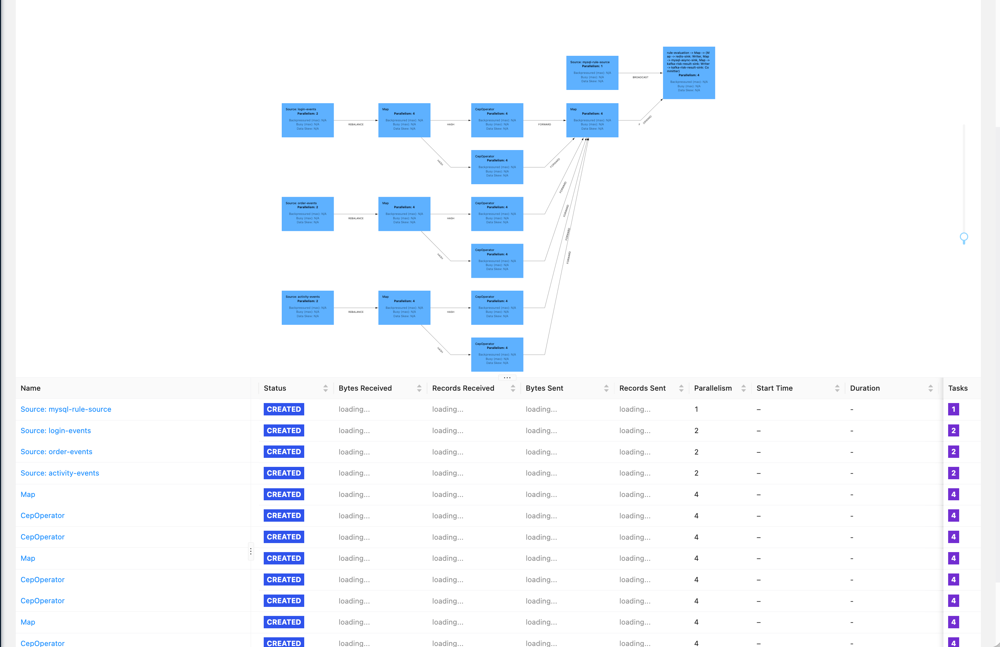

# Flink 规则引擎风控系统

<p align="center">
  <a href="https://flink.apache.org/"></a>
  <a href="https://spring.io/"></a>
  <a href="https://react.dev/"></a>
  <a href="https://kafka.apache.org/"></a>
  <a href="https://redis.io/"></a>
  <a href="https://www.mysql.com/"></a>
  <br>
  <a href="LICENSE"></a>
</p>

> 基于 Apache Flink 2.2.1 + CEP 的实时风控系统，支持动态规则配置、多场景事件检测、实时风险结果输出。

## 项目简介

这是一个面向电商/金融场景的**实时风控引擎**，通过 Flink CEP（复杂事件处理）对用户行为流进行毫秒级异常检测，结合 Aviator 动态规则引擎实现风险判定，并将结果实时推送到 Redis / MySQL / Kafka 多路下游，为业务系统提供拦截、告警、审核等决策能力。

### 核心能力

- **实时事件接入** — Kafka 三路 Topic 分别接收登录、下单、活动事件，通过 Flink 2.x 新版 `KafkaSource` API 消费，支持 Watermark 容错与事件时间语义
- **CEP 模式匹配** — 内置 6 类风控 Pattern，涵盖登录失败风暴、异地登录、频繁下单、快速下单、活动刷量、重复领券等场景，支持宽松连续匹配与时间窗口控制
- **动态规则引擎** — 基于 Aviator 表达式引擎，规则存储在 MySQL 中通过 BroadcastStream 每 30 秒拉取一次广播到所有 Task 实例，无需重启作业即可热更新规则
- **多路结果输出** — 风险判定结果同时写入 Redis（实时缓存，TTL 1 小时）、MySQL（持久化审计）、Kafka（下游消费），适配不同延迟要求的业务场景
- **可视化管理后台** — Spring Boot 3.2 + React 18 + Ant Design 5.x 构建的前后端分离管理界面，支持规则增删改查、风险记录查询、数据看板概览

### 技术亮点

| 特性 | 实现方式 |
|------|----------|
| 流处理引擎 | Apache Flink 2.2.1（最新稳定版），EventTime + Watermark 语义 |
| 事件匹配 | Flink CEP `Pattern` API，`followedBy` 宽松连续 + `within` 时间窗口 |
| 规则热更新 | `BroadcastState` + `RuleSourceFunction` 定时拉取，不停机更新规则 |
| 表达式引擎 | Aviator 5.4.3，编译缓存 + 注册校验，支持正则匹配、字符串函数等 |
| 消息队列 | Kafka 4.1.x KRaft 模式（无 Zookeeper），cp-kafka:8.1.4 |
| 缓存 | Redis 8.8，Jedis 5.2.0 客户端 |
| 高可用 | Flink Checkpoint 保障 Exactly-Once 语义，Kafka offset 自动提交 |

### 适用场景

- 电商营销风控：薅羊毛检测、刷单拦截、优惠券滥用
- 账户安全：暴力破解登录、异地登录告警、撞库检测
- 支付风控：高频大额下单、异常支付渠道、极速交易拦截

---

## 目录

- [项目简介](#项目简介)
- [系统架构](#系统架构)
- [模块结构](#模块结构)
- [系统截图](#系统截图)
- [技术栈](#技术栈)
- [快速启动](#快速启动)
- [CEP 风控场景](#cep-风控场景)
- [规则引擎](#规则引擎)
- [REST API](#rest-api)
- [数据库表](#数据库表)
- [Kafka Topic 格式](#kafka-topic-格式)
- [脚本工具](#脚本工具)
- [日志配置](#日志配置)
- [许可证](#许可证)
- [关于作者](#关于作者)

---

## 系统架构

```
Kafka Topics                    Flink 流处理引擎                     输出
┌──────────────┐    ┌───────────────────────────────────┐    ┌──────────────┐
│ login-events │───▶│ KafkaSource → keyBy(userId)       │───▶│ Redis (实时) │
│ order-events │    │     ↓                               │    │ MySQL (持久) │
│ activity-     │    │ CEP Pattern 匹配 (5s 窗口)         │    │ Kafka (下游) │
│   events      │    │     ↓                               │    └──────────────┘
└──────────────┘    │ BroadcastStream ← MySQL 规则拉取   │
                    │     ↓                               │
                    │ RuleEvaluationFunction (Aviator)    │
                    │     ↓                               │
                    │ RiskResult → Redis/MySQL/Kafka     │
                    └───────────────────────────────────┘
```

**核心流程**：Kafka 接收事件 → 按 `userId` 分组 → CEP 模式匹配（5s 窗口）→ Aviator 规则评估 → 多 Sink 输出（Redis/MySQL/Kafka）。

---

## 模块结构

| 模块 | 说明 | Java | 打包 |
|------|------|------|------|
| `flink-risk-common` | 公共模块：事件模型、Aviator 规则引擎、Redis 客户端、Kafka 反序列化 | 8 | jar |
| `flink-risk-job` | Flink 作业：Kafka Source → CEP → 规则评估 → 多 Sink 输出 | 8 | jar (shade) |
| `flink-risk-web` | Spring Boot 管理后端：规则 CRUD、风险记录查询、统计接口 | 17 | jar |
| `frontend` | React 管理界面：规则管理、风险记录、数据看板 | - | static |

---

## 系统截图

### 系统概览



### 规则管理



### 风险记录



### 数据看板



### FLINk job 运行图

---

## 技术栈

| 层级 | 技术 | 版本 |
|------|------|------|
| 流处理 | Apache Flink | 2.2.1 |
| CEP | Flink CEP | 2.2.1 |
| 规则引擎 | Aviator | 5.4.3 |
| 消息队列 | Kafka (KRaft 模式) | cp-kafka:8.1.4 |
| 缓存 | Redis | 7-alpine / 8.8 |
| 数据库 | MySQL | 8.0 |
| Web 后端 | Spring Boot | 3.2.0 |
| ORM | MyBatis Plus | 3.5.5 |
| 前端 | React + Ant Design | 18.3 / 5.22 |
| 构建 | Maven + Vite | 3.8+ / 5.4 |

---

## 快速启动

### 1. 启动 Docker 依赖组件

```bash
# 方式一：docker-compose
cd docker && docker compose up -d

# 方式二：shell 脚本（自动创建 Topics 和初始化数据库）
cd scripts && ./docker-start.sh start
```

Docker 组件：

| 服务 | 端口 | 说明 |
|------|------|------|
| MySQL | 3306 | 密码 `root123`，数据库 `flink_risk` |
| Redis | 6379 | 密码 `redis123` |
| Kafka | 9092 | KRaft 模式，Docker 内部 `kafka:29092` |
| Kafka UI | 9090 | http://localhost:9090 |
| Adminer | 8082 | http://localhost:8082 |

### 2. 启动 Web 管理后端

```bash
cd flink-risk-web
mvn spring-boot:run
# 访问 http://localhost:8080
```

### 3. 启动前端

```bash
cd frontend
npm install
npm run dev
# 访问 http://localhost:3000
```

### 4. 启动 Flink Job

```bash
# 编译打包
cd flink-risk-job
mvn package -DskipTests

# 本地运行（IDEA 调试或命令行）
java -cp target/classes:$(mvn dependency:build-classpath -Dmdep.outputFile=/dev/stdout) \
     com.qinyadan.risk.RiskControlApplication
```

### 5. 发送模拟数据

```bash
cd scripts

# 单场景测试
./event-simulator.sh login_failure user_001    # 登录失败3次
./event-simulator.sh order_frequent user_002   # 频繁下单3次
./event-simulator.sh activity_frequent user_003 # 频繁参与活动4次

# 全部场景
./event-simulator.sh all user_001

# 压力测试
./event-simulator.sh stress
```

---

## CEP 风控场景

| 场景 | Pattern 条件 | 时间窗口 | 触发规则 |
|------|-------------|---------|---------|
| 登录失败风暴 | 连续 3 次 `success=false` | 5s | `failCount >= 3` → HIGH/BLOCK |
| 异地登录 | 连续 2 次 `success=true` | 5s | `patternType == "LOCATION_CHANGE"` → MEDIUM/VERIFY |
| 频繁下单 | 连续 3 次下单 | 5s | `patternType == "ORDER_FREQUENT"` → HIGH/BLOCK |
| 快速下单 | 连续 2 次下单 | 5s | `patternType == "ORDER_RAPID"` → CRITICAL/BLOCK |
| 频繁参与活动 | 连续 4 次 `actionType="PARTICIPATE"` | 5s | `participationCount >= 4` → MEDIUM/WARN |
| 重复领券 | 连续 3 次 `actionType="CLAIM_COUPON"` | 5s | `patternType == "COUPON_REPEAT"` → HIGH/BLOCK |

---

## 规则引擎

规则存储在 MySQL `rule_config` 表，Flink Job 通过 `RuleSourceFunction` 每 30 秒拉取一次，通过 BroadcastStream 广播到所有并行实例。

规则表达式使用 Aviator 语法，可访问 CEP 匹配后的上下文变量：

| 变量 | 类型 | 来源 |
|------|------|------|
| `eventType` | String | 事件类型 LOGIN/ORDER/ACTIVITY |
| `patternType` | String | CEP 模式类型 |
| `userId` | String | 用户 ID |
| `failCount` | int | 登录失败次数 |
| `amount` | double | 订单金额 |
| `orderCount` | int | 下单次数 |
| `participationCount` | int | 活动参与次数 |
| `actionType` | String | 活动行为类型 |
| `channel` | String | 渠道 |
| `success` | boolean | 登录是否成功 |

预置 15 条规则，覆盖登录(4)、下单(5)、活动(4)、通用(2) 四个场景。

---

## REST API

### 规则管理

| 方法 | 路径 | 说明 |
|------|------|------|
| GET | `/api/rules?page=1&pageSize=10` | 分页查询规则 |
| GET | `/api/rules/{id}` | 查询单条规则 |
| POST | `/api/rules` | 创建规则 |
| PUT | `/api/rules/{id}` | 更新规则 |
| DELETE | `/api/rules/{id}` | 删除规则 |

### 风险记录

| 方法 | 路径 | 说明 |
|------|------|------|
| GET | `/api/risk-results?page=1&pageSize=10` | 分页查询风险记录 |
| GET | `/api/risk-results?userId=xxx` | 按用户查询 |

### 统计接口

| 方法 | 路径 | 说明 |
|------|------|------|
| GET | `/api/stats/overview` | 总览统计（规则数、风险事件数） |

---

## 数据库表

### rule_config（规则配置表）

| 字段 | 类型 | 说明 |
|------|------|------|
| id | BIGINT PK | 主键 |
| name | VARCHAR(100) | 规则名称 |
| expression | TEXT | Aviator 表达式 |
| risk_level | VARCHAR(20) | LOW/MEDIUM/HIGH/CRITICAL |
| action | VARCHAR(20) | ALLOW/VERIFY/BLOCK/REVIEW/WARN |
| weight | INT | 规则权重 |
| enabled | TINYINT(1) | 是否启用 |

### risk_result（风险检测结果表）

| 字段 | 类型 | 说明 |
|------|------|------|
| id | BIGINT PK | 主键 |
| user_id | VARCHAR(50) | 用户 ID |
| event_id | VARCHAR(50) | 事件 ID |
| event_type | VARCHAR(20) | LOGIN/ORDER/ACTIVITY |
| risk_level | VARCHAR(20) | 风险等级 |
| risk_score | INT | 风险分数 0-100 |
| action | VARCHAR(20) | 执行动作 |
| details | JSON | 详细信息 |

---

## Kafka Topic 格式

### login-events

```json
{
  "userId": "user_001",
  "eventId": "login_xxx",
  "eventType": "LOGIN",
  "timestamp": 1710000000000,
  "ip": "192.168.1.1",
  "deviceId": "dev_001",
  "success": false,
  "failureReason": "密码错误",
  "location": "北京",
  "browser": "Chrome"
}
```

### order-events

```json
{
  "userId": "user_001",
  "eventId": "order_xxx",
  "eventType": "ORDER",
  "timestamp": 1710000000000,
  "orderId": "ORD001",
  "amount": 50000.00,
  "productId": "SKU001",
  "productName": "异常商品",
  "quantity": 30,
  "paymentMethod": "可疑支付",
  "deliveryAddress": "异常地址",
  "processTime": 0
}
```

### activity-events

```json
{
  "userId": "user_001",
  "eventId": "act_xxx",
  "eventType": "ACTIVITY",
  "timestamp": 1710000000000,
  "activityId": "ACT001",
  "activityName": "双11大促",
  "couponCode": "CPN001",
  "couponValue": 50.00,
  "actionType": "PARTICIPATE",
  "participationCount": 5,
  "channel": "app",
  "source": "push"
}
```

---

## 脚本工具

### docker-start.sh

```bash
cd scripts
./docker-start.sh start    # 启动所有组件
./docker-start.sh stop     # 停止并移除
./docker-start.sh restart  # 重启
./docker-start.sh status   # 查看状态
```

### event-simulator.sh

```bash
cd scripts
./event-simulator.sh login_failure user_001    # 登录失败场景
./event-simulator.sh order_frequent user_002   # 频繁下单场景
./event-simulator.sh activity_frequent user_003 # 频繁活动场景
./event-simulator.sh coupon_repeat user_004    # 重复领券场景
./event-simulator.sh all user_001              # 全部场景
./event-simulator.sh batch 10                  # 10 轮综合场景
./event-simulator.sh stress                    # 压力测试
./event-simulator.sh cleanup                  # 清理重建 Topics
```

---

## 日志配置

Job 使用 Log4j2，配置文件 `flink-risk-job/src/main/resources/log4j2.properties`：

- 控制台 + 文件双输出
- 文件路径：`logs/flink-risk-job.log`
- 按天滚动，单文件 100MB，保留 30 天
- 业务日志 `com.qinyadan.risk` 包 DEBUG 级别
- Kafka/Flink 内部 WARN 级别

关键日志标记：`[SOURCE]` `[CEP]` `[EVAL]` `[RULE]` `[SINK-REDIS]` `[SINK-MYSQL]` `[SINK-KAFKA]`

---

## 许可证

本项目基于 [MIT License](LICENSE) 开源。

本项目使用了以下开源组件，感谢这些优秀的开源项目：

| 组件 | 许可证 | 说明 |
|------|--------|------|
| [Apache Flink](https://flink.apache.org/) | Apache-2.0 | 流处理引擎 |
| [Flink CEP](https://nightlies.apache.org/flink/flink-docs-stable/docs/libs/cep/) | Apache-2.0 | 复杂事件处理库 |
| [Spring Boot](https://spring.io/projects/spring-boot) | Apache-2.0 | Web 后端框架 |
| [React](https://react.dev/) | MIT | 前端 UI 框架 |
| [Ant Design](https://ant.design/) | MIT | 前端组件库 |
| [Apache Kafka](https://kafka.apache.org/) | Apache-2.0 | 消息队列 |
| [Redis](https://redis.io/) | BSD-3-Clause | 缓存数据库 |
| [MySQL](https://www.mysql.com/) | GPL-2.0 | 关系型数据库 |
| [Aviator](https://github.com/killme2008/aviatorscript) | LGPL-3.0 | 规则表达式引擎 |
| [MyBatis Plus](https://baomidou.com/) | Apache-2.0 | ORM 框架 |
| [Jackson](https://github.com/FasterXML/jackson) | Apache-2.0 | JSON 序列化 |
| [FastJSON2](https://github.com/alibaba/fastjson2) | Apache-2.0 | JSON 处理 |
| [JUnit 5](https://junit.org/junit5/) | EPL-2.0 | 单元测试框架 |
| [Log4j2](https://logging.apache.org/log4j/2.x/) | Apache-2.0 | 日志框架 |

---

## 关于作者

本项目由 [刘志敏](https://www.qinyadan.com/) 开发维护。

- **公众号**：关注「刘志敏」公众号，获取大数据、实时计算、风控系统等领域的技术文章与实战分享。
- **小程序**：搜索「刘志敏」小程序，随时随地浏览技术博客、项目案例与最新动态。

欢迎访问官网 [https://www.qinyadan.com/](https://www.qinyadan.com/) 了解更多内容。

> **开源不易，如果本项目对你有帮助，欢迎请我喝杯咖啡 ☕**
>
> 
